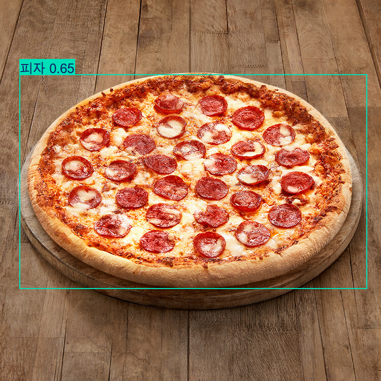
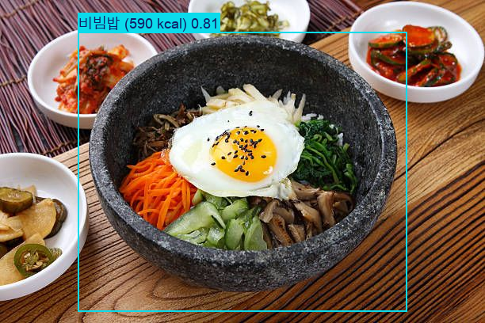
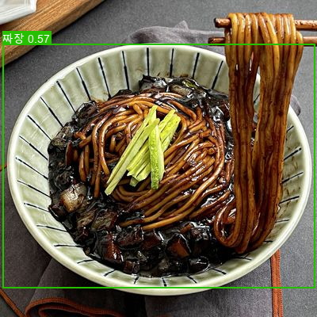
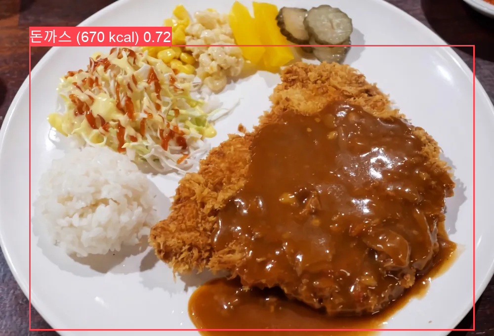

음식 칼로리 추정 어플리케이션
--

---
**Download**

- [data.zip](https://github.com/ssh9871/tensor_project/releases/latest/download/data.zip)

---
**Contributors**

- Happy623623
- 0-kyun
- gill1026
- chang-kyu
- ssh9871

---
**현재 학습한 음식 데이터**

- UECFOOD100 데이터셋
    - 밥
    - 비빔밥 
    - 햄버거 
    - 피자 
    - 스파게티 
    - 돈까스 
    - 계란후라이
    - 소시지

- 한국 음식 이미지   
    - 김치찌개   
    - 된장찌개   
    - 라면   
    - 삼겹살   
    - 짜장면   
    - 짬뽕   

---

**사용방법**

- model_train.py를 실행하여 yolo모델 학습

- test_images 폴더에 bbox를 표시할 사진들을 넣기

- test.py를 실행하면 result_images 폴더가 생성됨

---
**실행 결과**

